# Environment polish — 2026-09-11

Terrain, rock framing and lighting for the three cave scenes. Gameplay, quests,
dialogue, the boss state machine, collision categories, camera and world sizes
are unchanged; this pass only replaces the prototype floors and adds
environment art on top of the existing abstractions.

Asset provenance, seam metrics and normalization:
`asset-audit/environment-2026-09-11/REPORT.md`.

## Dungeon entrance

Before / after:

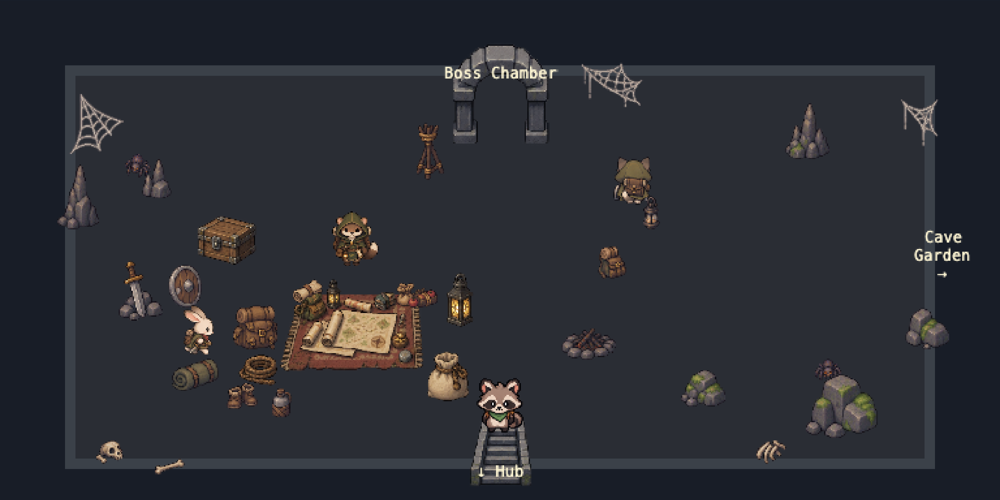
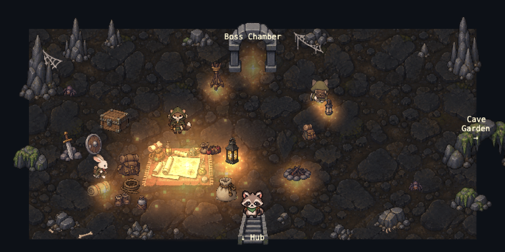

The flat `0x292d35` rectangle is gone. The floor is the audited cave ground
tiled at 426px with its tone baked down to 60% brightness, so the room is dark
enough for light to matter. Spires and boulders from the rock sheet frame the
four corners and both side walls, a mossy rock arch marks the east passage, and
the camp is lit by additive amber pools over the mat, the lantern, the torch
stand, the campfire and the cat's lantern, with a dim one at the gate.

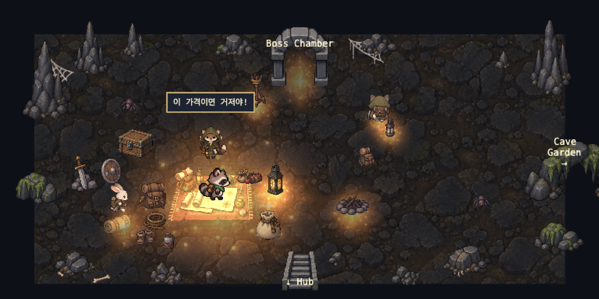

Everything that was already there — merchant, mat, rabbit, cat, spiders, camp
gear, webs, bones — is untouched. The six generic rock props from the old
ambient set were replaced by the dedicated rock sheet at the same collision
footprints.

## Boss chamber

Before / after at the statue:

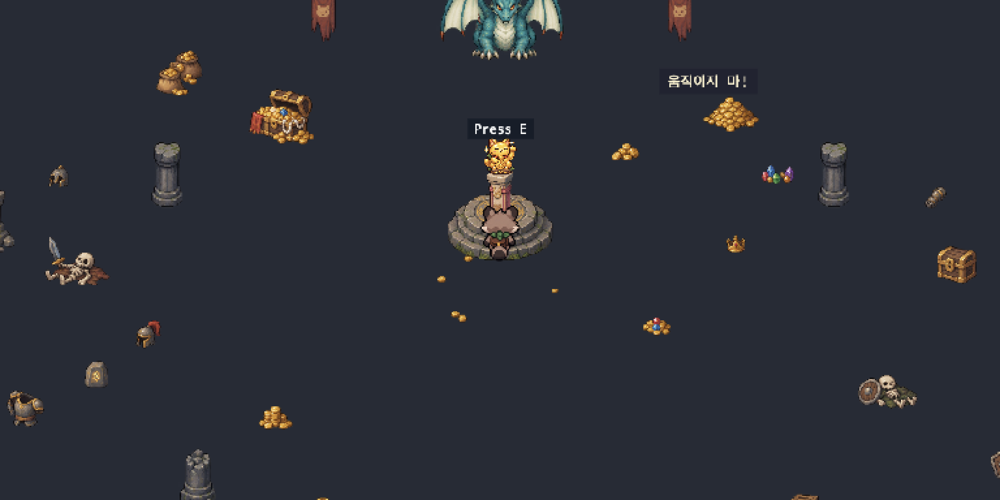
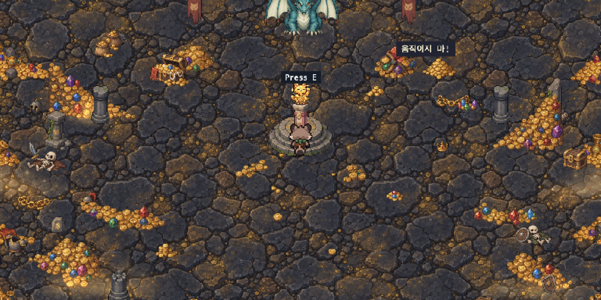

The floor is the ancient-stone ground with gold dust in its cracks, kept
brighter than the entrance. Five hoards bank up each side wall — the right wall
mirrors the same art — and spill inward through mounds, trails and loose coins.

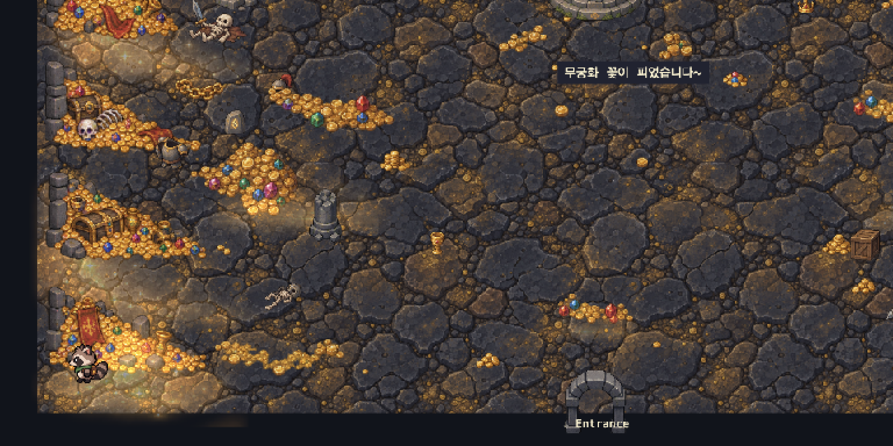
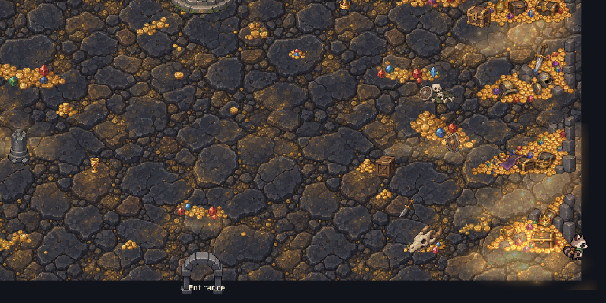

Gold bounce sits on the hoards as additive slope and band glows. Nothing warm is
placed over the boss or the statue, so neither is tinted and the Golden Cat still
separates from the room:

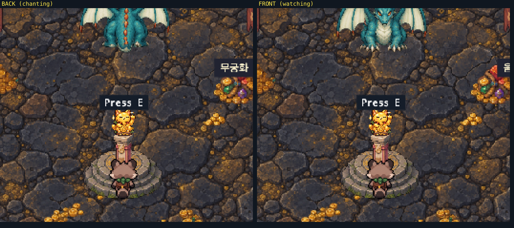

The skeletons, armour, helmets, shields and broken swords that were already in
the room stay; three of them and the two pillars added in the previous pass moved
inward so the new hoards do not cover them. The centre column from the entry to
the statue, and the room's open middle, are left clear for the chase.

## Cave garden

Before / after:

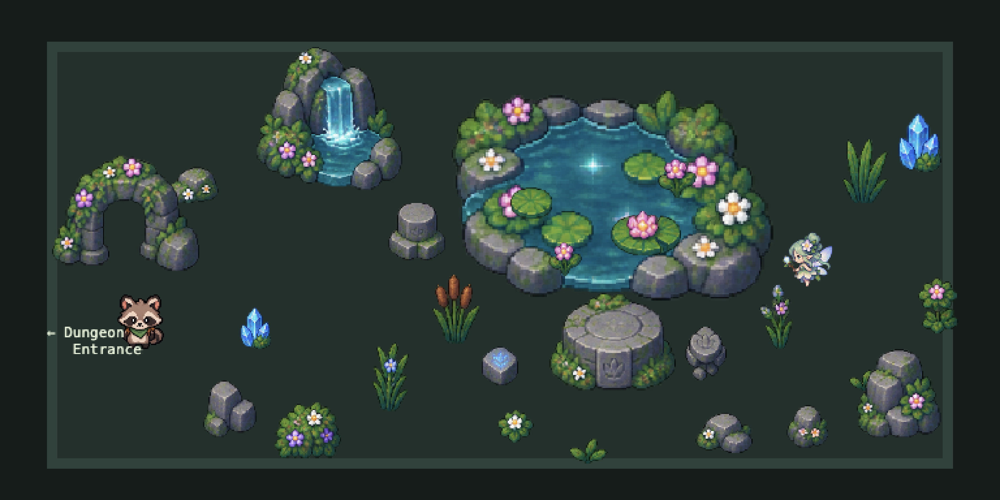
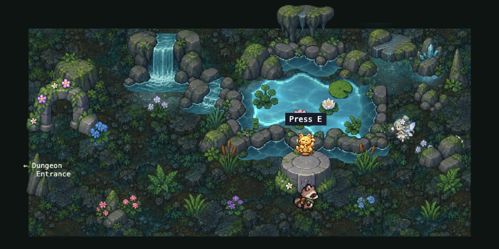

The garden is rebuilt on the wet mossy ground tile. The single pond sprite is
replaced by a free-form body of water with rock banks from the pond-edge sheet,
ringed by mossy boulders, reeds, cattails and ferns so the water reads as part of
the floor rather than an object placed on it. A waterfall and stream feed it from
the north west, lilies and lotus sit on the surface, crystals and stalactites
frame the edges, and teal caustics, crystal sparkles and one light shaft are the
only light.

The altar, its offering logic, the fairy, her float and every interaction range
are unchanged.

## Seam proofs

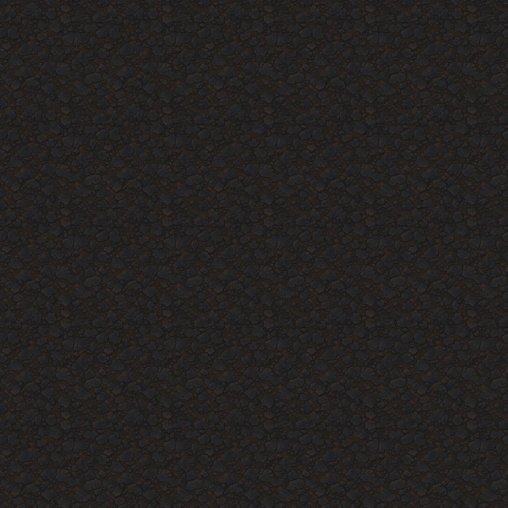
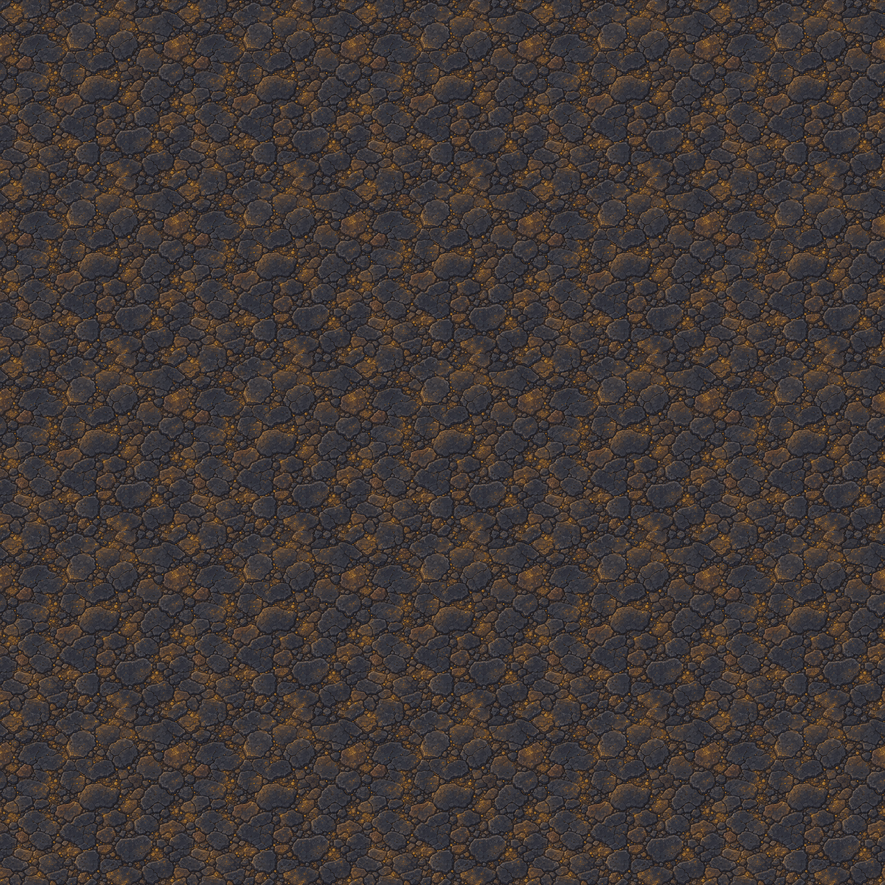
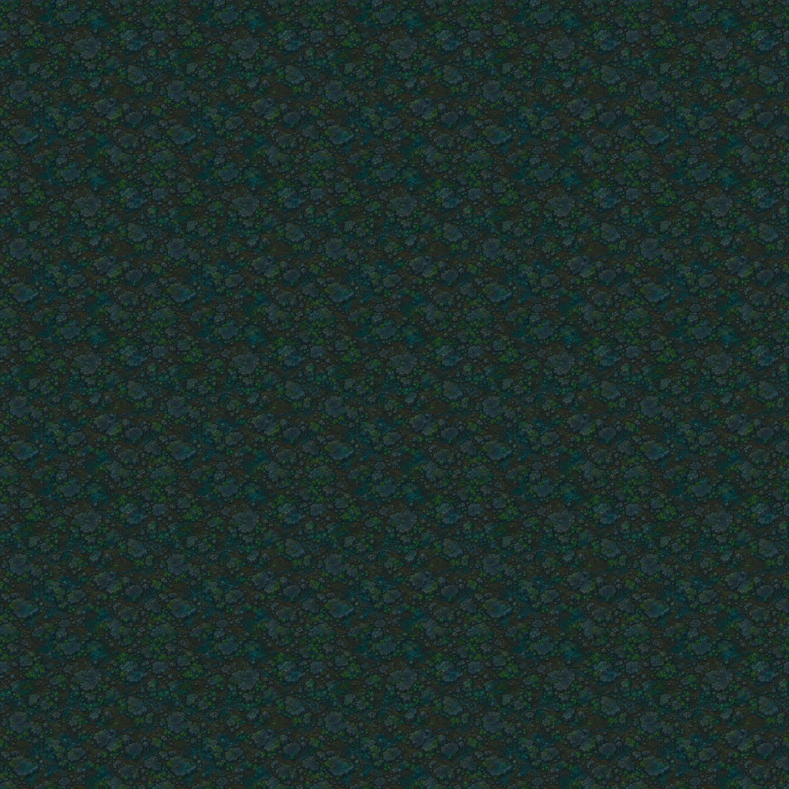
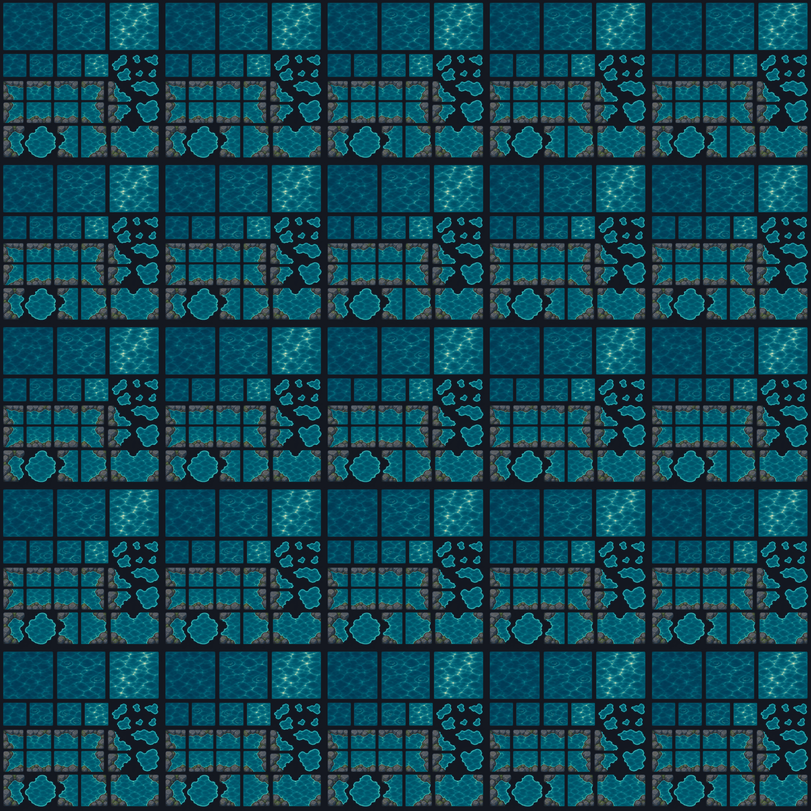

The first three tile cleanly at 5×5. The fourth shows why the water sheet was
rejected as a repeating fill: it is a sheet of separate water cells, not a
texture.

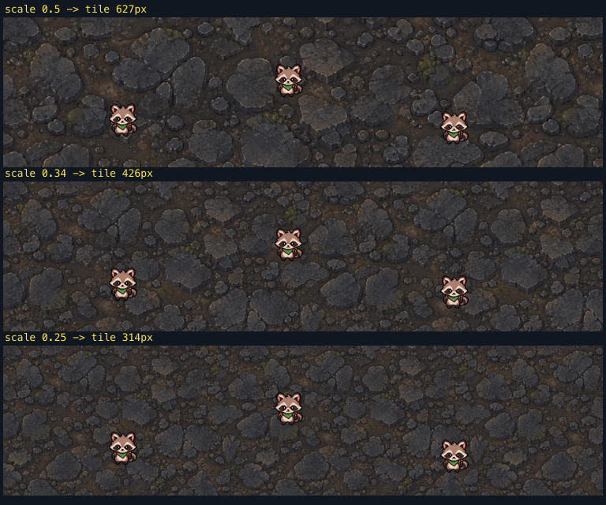

## Collision and depth

Collision categories are untouched. New terrain follows the existing rules:
ground and glow carry no collision at all; new rocks, hoards and the pond get
foot-sized footprints, never sprite bounds; wall hoards and floor piles are
`body` so the player is stopped and the chase is not; only pillars remain
`structure`.

Depth follows the existing convention: ground at 0, flat art at 1–2, light pools
just above the floor, everything upright on its bottom Y, glows that belong to a
hoard pinned just above that hoard's depth, and the boss caption and prompts
still on 1000.

## Runtime checks

Real Chrome 129 over the DevTools protocol against `next dev`.

| Area                                                                         | Result |
| ---------------------------------------------------------------------------- | ------ |
| Entrance floor distinct from the boss chamber, cave framing, warm camp light | pass   |
| Entrance NPC readability, centre route clear, rabbit and cat `E`             | pass   |
| Merchant mat speech still fires on entry                                     | pass   |
| Boss chamber ground, both treasure walls, spill into the middle              | pass   |
| Existing skeletons and armour still visible among the hoards                 | pass   |
| Golden Cat not washed out, boss BACK/FRONT readable from the statue          | pass   |
| Statue interaction, HUD icon, chase, game over, retry, quest reset           | pass   |
| Garden ground, pond reads as terrain, fairy and altar readable               | pass   |
| Fairy dialogue, altar dialogue, offering, statue on the altar, HUD           | pass   |
| Pond stops the player                                                        | pass   |
| Hub ↔ entrance ↔ boss ↔ garden transitions, scene re-entry                   | pass   |
| Console errors, page errors, failed resource loads                           | none   |

## Legacy assets

- `garden_pond_tileset.png` — no longer referenced by any scene. Left in place.
- `dungeon_tileset.png` — still used: the entrance arch and stairs, and the boss
  chamber's pillars, broken pillar, crate and the statue's churu pillar.
- `cave_garden_props.png` — audited this pass, not used; the garden is built from
  the environment sheet.

No asset files were deleted.
