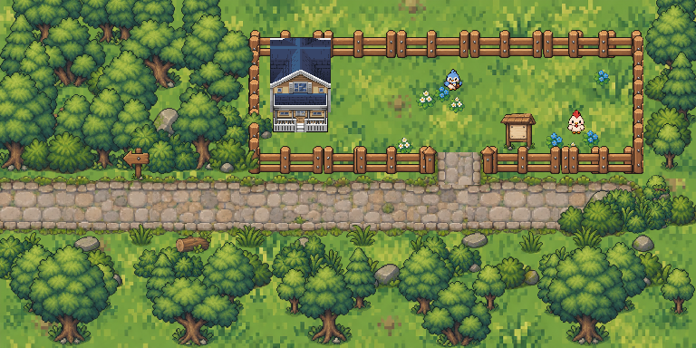
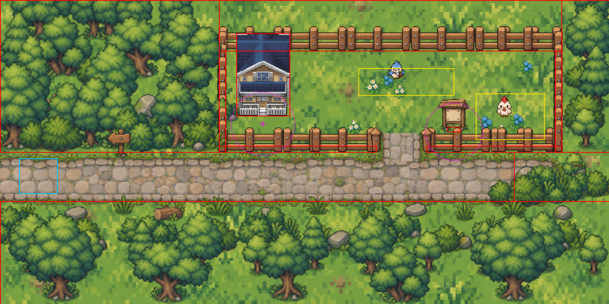

# Home rework — 2026-09-13

Home is now a cozy countryside yard instead of a field of prototype grass. The
scene transition structure is untouched: Home still has exactly one exit, west
to the market, at the same `{ x: 24, y: 200, width: 48, height: 44 }` zone, and
the market still arrives at `(128, 224)`.

```
                 [ COTTAGE ]
      ┌──────────────────────────────────────┐   yard fence
      │                                      │   x 280..704, y 64..192
      │   bird      flowers    chicken       │   walkable x 292..692, y 72..184
      └────────────────┐  ┌──────────────────┘
                       │  │  gate x 474..538
   ════════════════════╧══╧═══════════════════   paved road, foot y 200..254
   ^ exit to market (x 24..72, y 200..244)
```




The second image draws every blocker in red, the exit zone in cyan, the two
wander boxes in yellow and the interaction radii in magenta.

## Layout

| Thing                       | Where                                |
| --------------------------- | ------------------------------------ |
| Road corridor (player foot) | y 200..254, x 48..640                |
| Yard fence                  | x 280..704, y 64..192                |
| Yard interior (player foot) | x 292..692, y 72..184                |
| Gate opening                | x 474..538, foot corridor x 482..530 |
| Cottage                     | drawn x 298..365, y 42..146          |
| About point                 | (331, 156), range 40                 |
| Notice board                | (572, 166), range 36                 |
| Bird wander                 | x 452..572, y 86..120                |
| Chicken wander              | x 600..686, y 118..176               |
| Default spawn               | (506, 160)                           |
| Market spawn                | (128, 224)                           |

The default spawn is the only spawn this rework moved. The old `(384, 310)` now
sits inside the boundary forest south of the road.

## Assets

`asset-audit/home-2026-09-13/frames.json` holds the source rectangle of every
frame used here. It is generated, not hand-written: each sheet is thresholded at
alpha >= 128, components are joined with a 2px dilation and then measured
against the _undilated_ mask, so no rect carries a semi-transparent fringe. A
fringe is what makes tiled frames show a seam.

- Ground is one 1254x627 crop of `home_grass_terrain.png` stretched over the
  whole world: no repeat, so no tile seam anywhere.
- Roads use `outdoor_fantasy_paved_road_tileset`. `outdoor_dirt_road_tileset` is
  registered as a shared asset but deliberately not preloaded by Home.
- The fence sheet draws runs side-on only and has no north-south piece, so the
  side fences are a 16px-pitch row of the bare post cropped from the run piece.
- The cottage is the one prop with no new art in this batch. `home_tile.png` is
  opaque on a checkerboard backdrop, so only backdrop-free rectangles may be
  drawn; the two maximal clean blocks are stacked into one silhouette.

## Code

| File                            | Role                                      |
| ------------------------------- | ----------------------------------------- |
| `game/config/home.ts`           | All Home geometry, props, NPCs, collision |
| `game/config/homeAssets.ts`     | Texture keys and audited frame lookup     |
| `game/objects/homeScenery.ts`   | Pure draw plan, no Phaser                 |
| `game/objects/HomeMap.ts`       | Turns the plan into game objects          |
| `game/objects/HintBubble.ts`    | The board's persistent "Read Me!" label   |
| `game/scenes/PortfolioScene.ts` | Scene wiring and the interaction pick     |

`homeScenery()` is deliberately Phaser-free so the layout can be rendered
offline and reviewed before it ships.

Every bound in `home.ts` is written in **player foot coordinates**.
`Player.canMove` tests an 8px tall, 16px wide foot box, so a blocker whose
bottom edge is `B` lets the foot reach `B + 8`, and one whose left edge is `L`
stops the foot at `L - 8`.

## Interaction

The cottage, the notice board, the bird and the chicken are one list in
`PortfolioScene`, and `nearestTarget()` picks a single winner, so two targets
can never fire from one `E`. The board suppresses the shared prompt and swaps
its own bubble between `Read Me!` and `Press E` instead.

Home's dialogues (`homeSign`, `homeBird`, `homeChicken`) are separate ids from
the market's `bird` / `chicken`, so the market's ambient lines are unchanged. A
dialogue that declares `exit` now renders a real choice list, which is what
gives these panels their 나가기 option without inventing a question.

## Not done here

- The cottage art still reads cooler than the new warm props. No house sprite
  was part of this asset batch; replacing it needs new art.
- Home preloads about 16.8 MB of textures. The sheets are 1536x1024 originals
  and Home uses a small part of each. Cropping them to the used regions is the
  obvious follow-up.
- `docs/world-2026-09-10/REPORT.md` still describes a north exit from Home to
  the dungeon entrance and a four-rectangle `HUB_PATH`. Neither has existed in
  the code for some time; that document is stale, not a spec.
