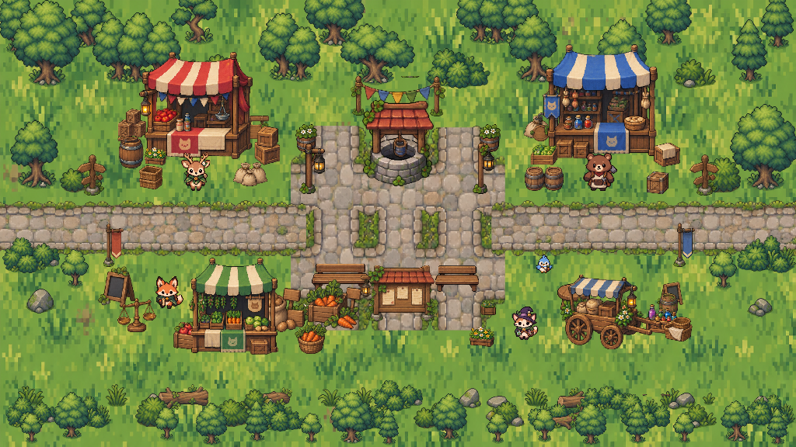
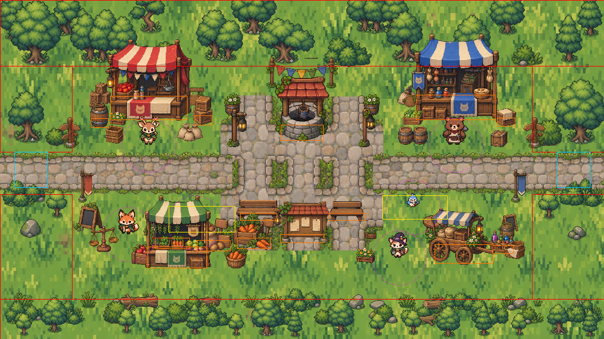

# Market rework + game state — 2026-09-14

Market grew into a walled market square with four shops around a cobbled plaza,
and the game gained the pieces a save needs: a player name, a quest, settings
and an audio toggle.

```
                                   NORTH
   ┌──────────────────── boundary planting ─────────────────────┐
   │   ┌─ RESUME ─┐                          ┌─ SKILLS ─┐       │
   │   │  stall   │      ╔═ PLAZA ═╗         │  stall   │       │
   │   │   deer   │      ║  well   ║         │   bear   │       │
   │   └──────────┘      ║         ║         └──────────┘       │
 GUILD ══════════════════╬═════════╬════════════════════════ HOME
   │   exit x24..80      ║ benches ║        exit x944..1000     │
   │   ┌─ PROJECTS ┐     ║ board   ║        ┌─ GOSSIP ─┐        │
   │   │ fox + 🐔  │     ╚═════════╝        │   cat    │        │
   │   └───────────┘                        └──────────┘        │
   └────────────────────────────────────────────────────────────┘
                                   SOUTH
```




The second image draws blockers in red, prop footprints in orange, exit zones
in cyan, wander boxes in yellow and interaction radii in magenta.

## World and camera

Market is **1024 × 576**, the only scene larger than the 768 × 384 viewport.
`WORLD` is untouched, so Home, the Guild and the dungeon keep their size; the
Market scene passes its own bounds to `Player` (which already accepted a world
size) and gives its camera `setBounds` + `startFollow`. There is **no zoom
change** — sprites are exactly the size they are in Home.

| Thing                    | Where                                |
| ------------------------ | ------------------------------------ |
| World                    | 1024 × 576                           |
| Player clamp             | x 48..976, y 56..552                 |
| Market square (walkable) | x 130..894, y 120..508               |
| Street arms (walkable)   | x 48..130 and x 894..976, y 258..330 |
| Plaza (cobbled)          | x 392..632, y 186..402               |
| Guild exit               | `{ x: 24, y: 258, w: 56, h: 60 }`    |
| Home exit                | `{ x: 944, y: 258, w: 56, h: 60 }`   |
| Spawn from Guild         | (160, 294)                           |
| Spawn from Home          | (864, 294)                           |
| deer / Resume            | (252, 246)                           |
| bear / Skills            | (772, 246)                           |
| fox / Projects           | (218, 398)                           |
| cat / Gossip             | (676, 438)                           |
| bird                     | (700, 352), wanders x 648..758       |
| Kkokko (after the quest) | (330, 378), wanders x 286..398       |

Both spawns sit 80px inside their own exit, so a held key can never bounce the
player straight back. Reachable area is 57.9% of the clamp rectangle, with no
stranded pockets — the rest is boundary planting.

A walkway runs under both southern shops: their stall bases sit at y 452..458
and the boundary starts at y 508, so the player can walk from the Projects shop
to the Gossip shop along the south side. The vegetation was moved down with it
(verge y 516..532, bushes y 546..556, small trees y 566..576) and every canopy
was scaled so nothing solid reaches back up into the walkway.

## Assets

`asset-audit/market-2026-09-14/frames.json` is generated the same way Home's
was: alpha ≥ 128 mask, 2px dilation to join sprite parts, bounding boxes
measured on the **undilated** mask so no rect carries a translucent fringe.
Indices were confirmed against rendered contact sheets, not guessed from names.

- Ground is Home's `home_grass_terrain` at Home's exact pixel density. The
  texture is narrower than this world, so the second copy is mirrored: a
  reflection joins seamlessly where a repeat would show a seam.
- Road and plaza come from `outdoor_fantasy_paved_road_tileset`. The plaza uses
  the set's crossroad pieces, drawn 1.45× their step so each tile's arms cover
  its neighbour's grassy corners and the square fills in solid.
- Boundary planting reuses the tree and natural-props sheets Home already
  audited, via `sharedFrame`.
- The four stalls are still the audited `market_tileset` props, re-placed.

## Code

| File                            | Role                                               |
| ------------------------------- | -------------------------------------------------- |
| `game/config/market.ts`         | All Market geometry, props, NPCs, collision        |
| `game/config/marketAssets.ts`   | Market sheets + shared lookups + CSS frame helpers |
| `game/objects/marketScenery.ts` | Pure draw plan, no Phaser                          |
| `game/objects/MarketMap.ts`     | Turns the plan into game objects                   |
| `game/scenes/MarketScene.ts`    | Camera, NPCs, nearest-target, Kkokko               |
| `game/state/gameState.ts`       | Save: name, quest, settings                        |
| `game/state/useGameState.ts`    | React view of the save                             |
| `game/state/bgm.ts`             | Audio controller, waiting for a track              |

## Save format

```json
{
  "version": 1,
  "playerName": "…",
  "quests": { "findKkokko": "NOT_STARTED|ACCEPTED|CHICKEN_FOUND|COMPLETED" },
  "settings": { "bgmEnabled": true }
}
```

Stored at `portfolio-rpg-save`. Every field is validated on load and falls back
field by field, so an old or hand-edited save cannot break the game. Reset
clears progress but keeps `bgmEnabled`, which is a device preference.

## Quest flow

`NOT_STARTED` → ask the fox → `ACCEPTED` → carry Home's chicken back →
`CHICKEN_FOUND` (HUD shows her) → talk to the fox → `COMPLETED` (HUD clears,
Kkokko appears in the square, the special Notion link unlocks).

Home's chicken is only built while the quest is `NOT_STARTED` or `ACCEPTED`.
Kkokko is added to the Market either at scene creation or, if the quest is
finished while standing there, on the next frame.

## Interaction rule

`components/game/useInteractionKeys.ts` is the single keyboard layer every
panel uses. It matches on **`event.code`**, not `event.key`: with a Hangul IME
active the E key reports `key === 'ㄷ'`, which used to make every panel ignore
E while Phaser — matching on keyCode — still opened them. It also holds confirm
disarmed until the E that opened the panel is released, so one press can never
both open a panel and activate its first choice.

Every panel ends in **나가기**. Arrow keys move the selection, `E` confirms,
`Esc` closes, and `Enter` is swallowed everywhere.

In the fox's shop each produce card is itself a choice; there is no second row
of "프로젝트 보기" buttons. Keyboard order is Check Eat → Stadiumly → Spotking →
어떤 도움이 필요한지 묻기 → 나가기, wrapping at both ends like `InfoPanel`.

## Not done here

- No BGM track exists. `BGM_TRACK_URL` is `null` on purpose so nothing 404s;
  setting it to a real path is the only change needed.
- Market preloads about 23.8 MB, mostly 1536×1024 sheets it uses a fraction of.
  Cropping them to the used regions is the obvious follow-up, and applies to
  Home too.
- `docs/market-prototype/README.md` describes the 768×384 prototype and is now
  historical. Its prop table no longer matches these coordinates.
