# World rework — 2026-09-10

Home now connects only west to the market and north to the dungeon entrance; the
cave garden hangs off the dungeon entrance instead of Home.

```
                     DUNGEON
                        |
               DUNGEON ENTRANCE ----> CAVE GARDEN
                        |
                       HOME
                      /
                  MARKET
```

Asset provenance and normalization: `asset-audit/world-2026-09-10/REPORT.md`.

## Home routes

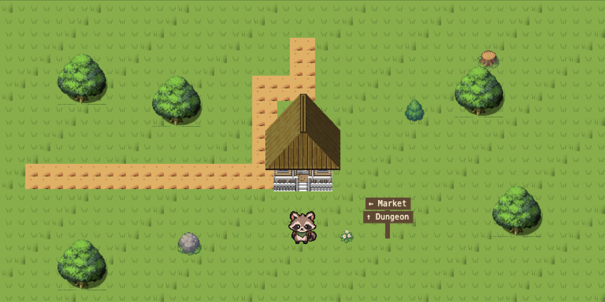

`HUB_PATH` is down to four rectangles: the west market road, the vertical along
the west wall of the home, the corner, and the north stub to the dungeon. The
east (garden) road and the southern dead end are gone and the ground generator
paints grass there again, so no route ends in a cut edge. The signpost lists
`← Market` and `↑ Dungeon`; the garden is signposted at the dungeon entrance.

## Dungeon entrance


The merchant and mat are unchanged. Added: a resting rabbit adventurer, a cat
adventurer watching the gate, two drifting spiders, three webs, camp gear
(bedroll, backpacks, rope, boots, bottle, food, scroll, firewood, torch stand,
lantern, sword, shield), cave rock and bone dressing, and the `Cave Garden →`
sign on the east wall. Both new NPCs answer `E`.

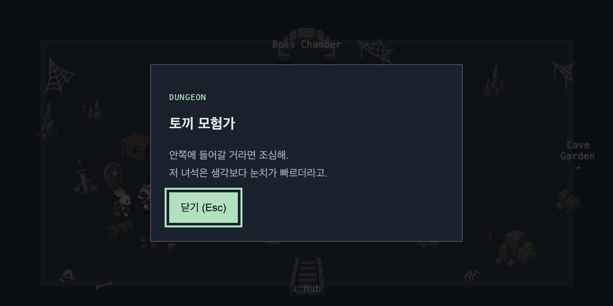
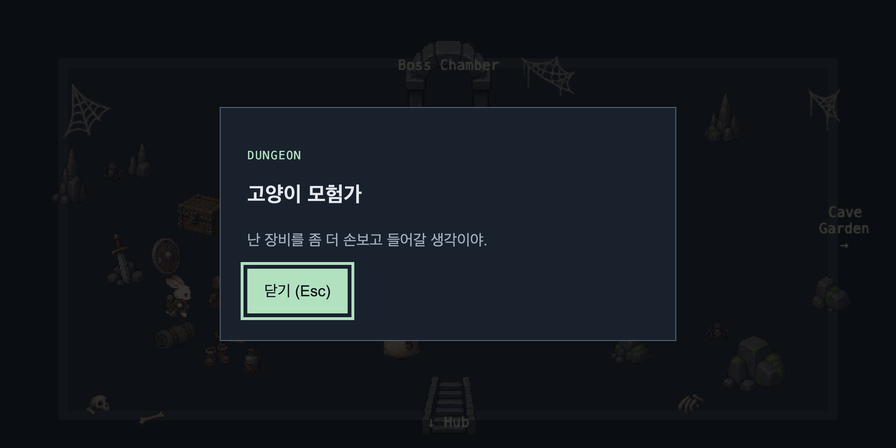

### Merchant mat speech

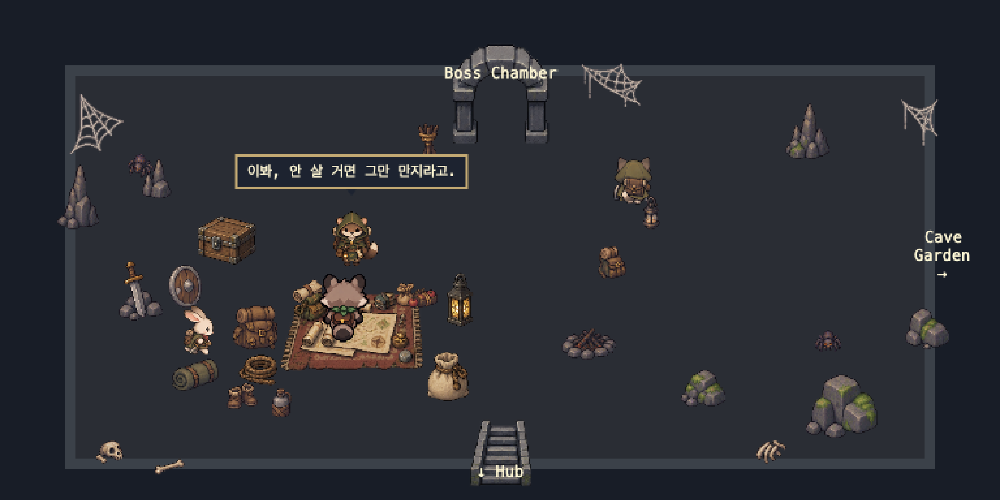
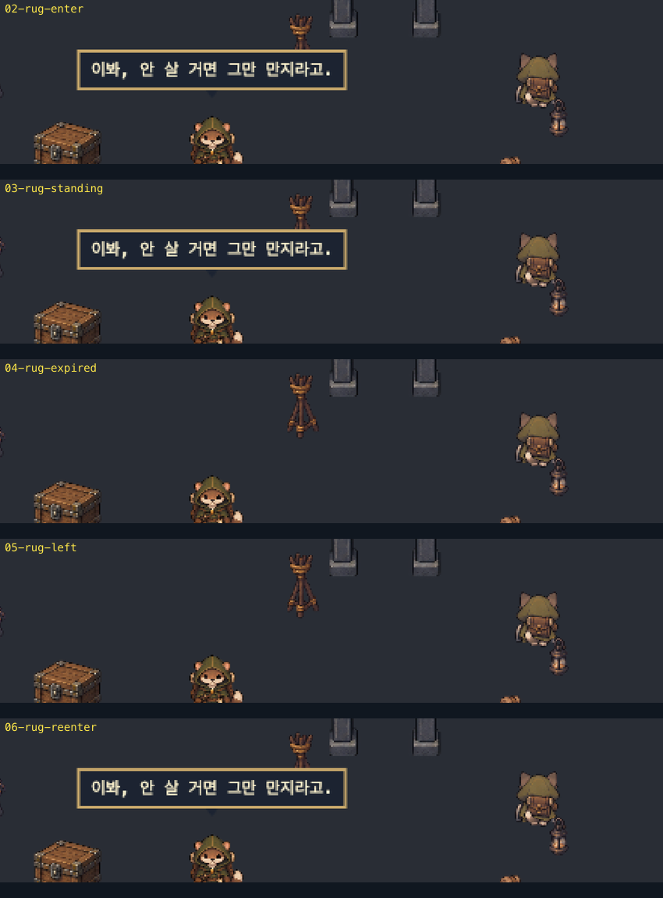

Stepping onto the mat trigger (`x222-318 / y244-286`) shows one of two random
lines above the merchant for 1.8s. Standing inside does not repeat it; leaving
and stepping back in picks a new line. Measured over ten entries the bubble
frame alternated between the two line widths (114px and 178px), so both lines
are live. Movement is never locked, and opening the merchant dialogue hides the
bubble.

## Boss chamber


Treasure, remains and two extra pillars fill the room; the Golden Cat keeps the
centre and now stands on the cat dais. The entry column, the approach to the
statue and the room edges stay walkable.

### Golden Cat placement

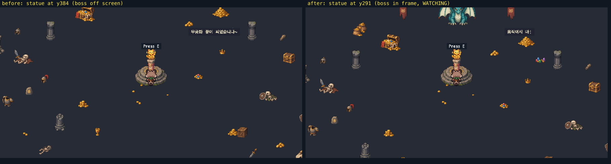
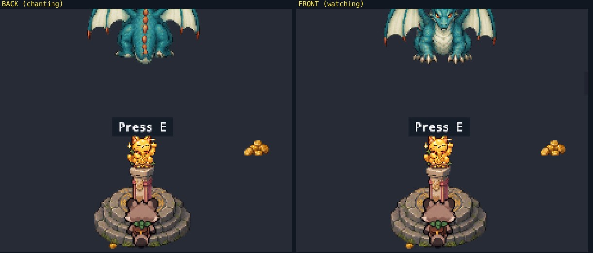

The statue is placed from the boss/entry relationship rather than a fixed
coordinate: `STATUE_BOSS_RATIO = 0.3` puts it at `y291`, three tenths of the way
from the boss (`y116`) to the entry (`y700`), instead of the old `y384`
mid-room spot where the boss sat off screen while the player took the statue.
The churu pillar, the cat dais and the three central coin pieces are all
expressed as offsets from that point, so they travel with it.

At the interaction spot the player stands at `y≈299`, blocked by the pillar
footprint, and the camera shows `y59-539`: the boss's face, belly and spine
ridge are all in frame, so `BACK` and `FRONT` stay readable at the moment the
statue is taken. Camera zoom is unchanged.

Standing through a whole `WATCHING` window at the statue is still safe, and
fleeing south the instant `WATCHING` starts survived 8.2s of continuous running
in the browser, so the closer placement does not make the window lethal.

Collision is split into three groups. `structure` props enter both the boss and
player lists, `body` props only the player list, and `floor` props carry no
footprint at all:

- boss blocked: stone pillars, broken pillars, rune pillar, statue pillar
- boss free: coins, coin piles, chests, skeletons, armour, gems, crowns, runes,
  dais, banners
- player blocked: coin piles, coin stacks, coin sacks, chests, skeletons,
  armour torso, beast skull, crate, pillars
- player free: scattered coins, single coins, gems, crown, goblet, helmets,
  gauntlet, broken sword, round shield, rune stone, dais, banners

Measured in the browser (changed pixels while holding a direction, so a large
number means the player moved): walking over `coins_scattered` scrolled the room
(292843), walking into `coin_stack` did not (182), and walking into the statue
pillar produced the same frame twice (665, 665).

### Chase animation

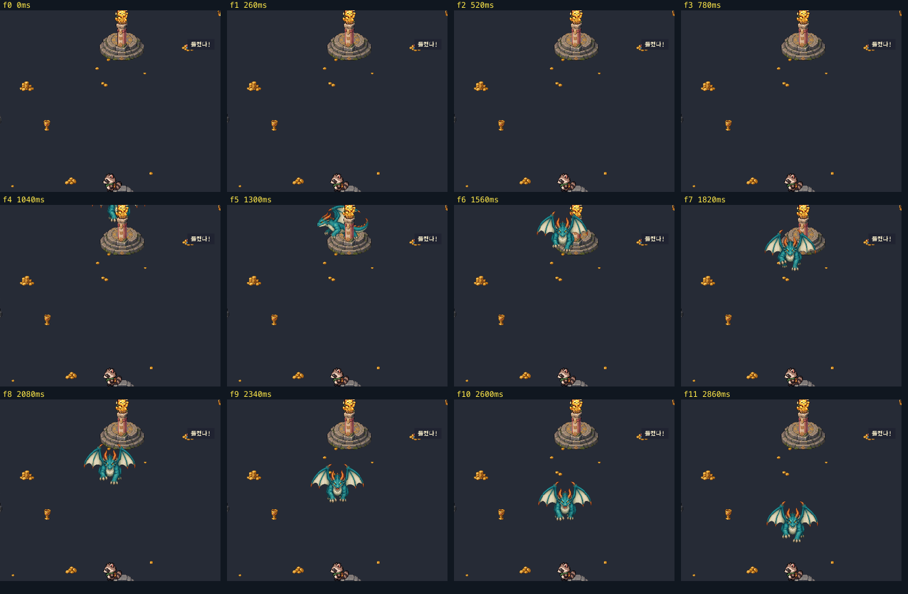

The `CHASE` state now plays the normalized chase sheet at 6 fps with a
`1→2→3→2` cycle per direction; `BACK`, `CHANTING` and `WATCHING` keep the
original stills. The pose follows the movement that actually happened, so the
frame above shows the boss facing left while it steps around the statue pillar
and facing down once it is past.

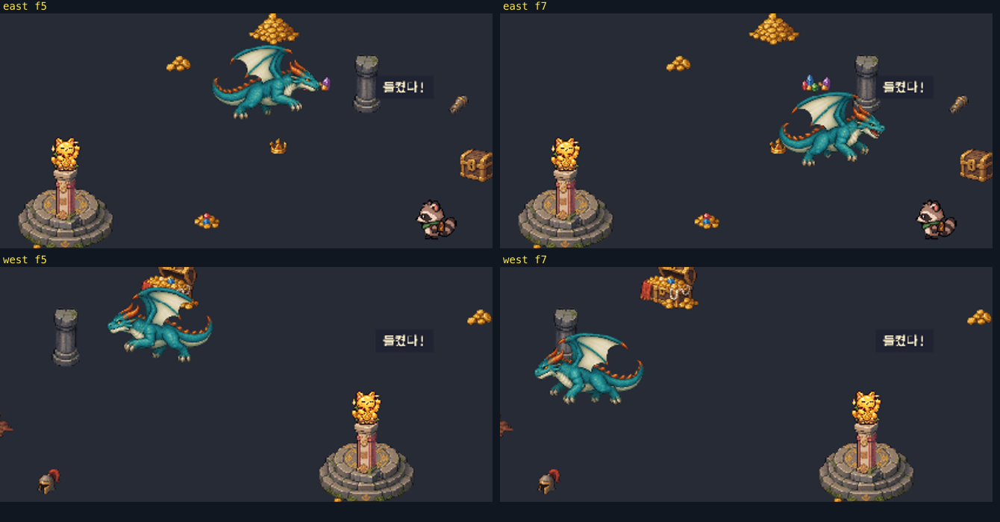
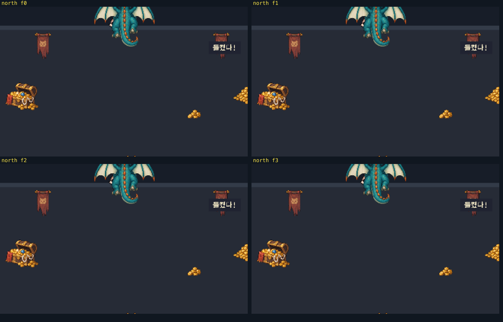

Pillars stop the boss but must not shelter the player, so a boss whose direct
path is blocked steps around the pillar at its normal speed; a boss that cannot
move at all pauses its animation instead of running in place. Boss speed,
timings, movement threshold and catch distance are unchanged.

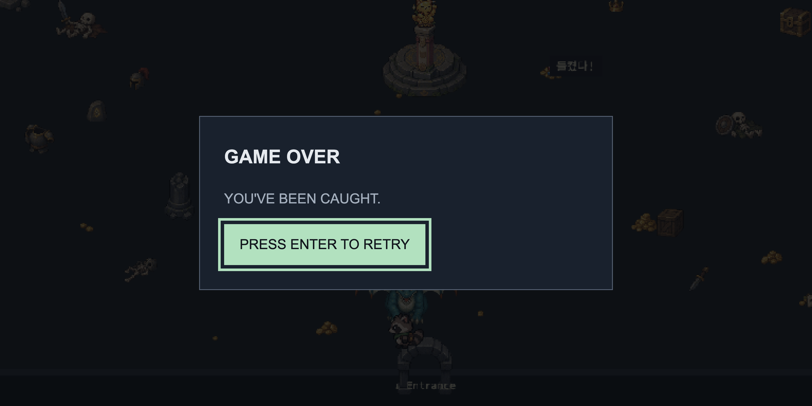

## Cave garden


A new scene east of the dungeon entrance: underground pond, waterfall, flower
arch over the west exit, crystals and plants, the fairy beside the pond and the
offering altar in front of it.

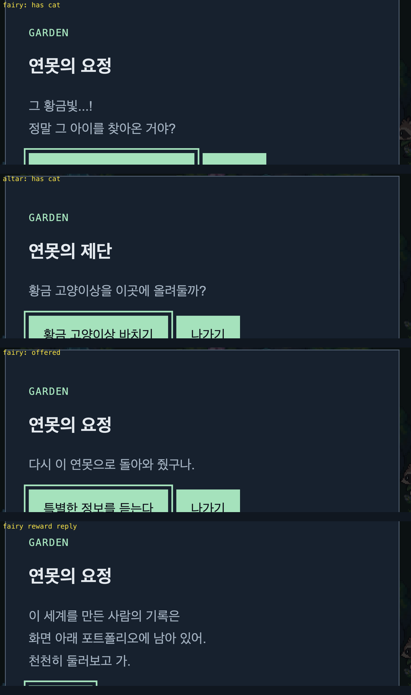

The fairy reads three states from `hasGoldenCat` and `goldenCatOffered`, and the
altar reads the same two. Offering clears the carried statue, hides the HUD icon
and places the statue on the altar.

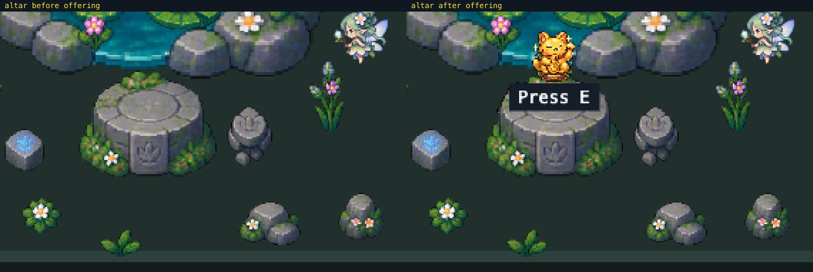
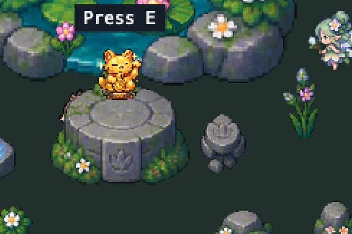

### Fairy float

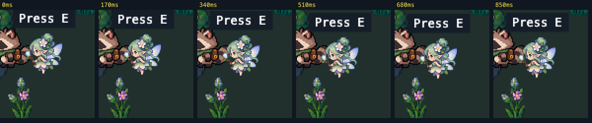

A yoyo tween drifts the fairy sprite 5px up and back over 750ms each way, eased
with `Sine.easeInOut`. Only the sprite moves: both interaction ranges are
measured against the configured points, so the float cannot change how close
the player has to stand, and the sprite's depth and footprint stay fixed.
Measured in the browser: 4–5px of travel, a ~1.44s cycle, zero horizontal
drift, and eight consecutive `E` presses at the edge of the range (42px of 44)
all answered. Re-entering the scene keeps the same amplitude, so no second tween
is left behind.

## Market regression

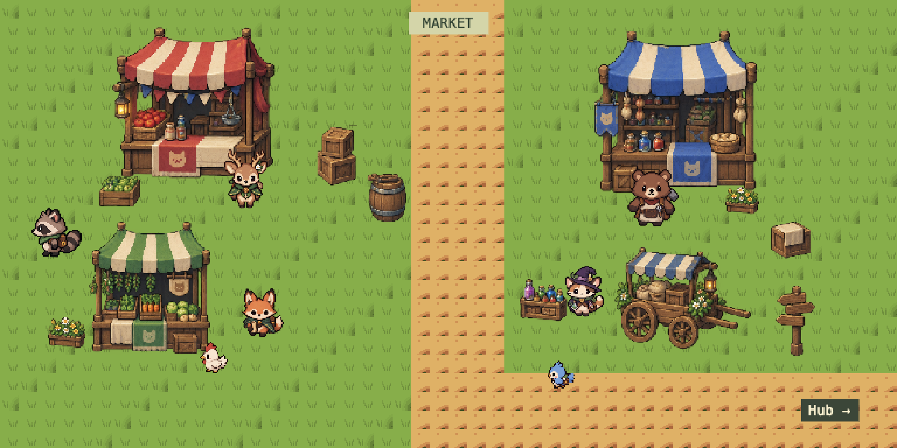

Market, its NPCs and both transitions are unchanged; the deer dialogue, its
branch reply and the interaction-miss bubble were re-checked after the loader
scoping change.

## Runtime checks

Real Chrome 129 driven over the DevTools protocol against `next dev`.

| Area                                                              | Result |
| ----------------------------------------------------------------- | ------ |
| Home routes, signpost, market and dungeon transitions             | pass   |
| Entrance camp render, rabbit `E`, cat `E`, spiders drifting       | pass   |
| Mat speech: enter, hold, expire, re-enter, both lines, no lock    | pass   |
| Boss chamber decoration, Golden Cat pickup, HUD icon              | pass   |
| Statue at 3:7, boss readable from the statue, escape margin       | pass   |
| Chase animation down / left / right / up, direction switching     | pass   |
| Boss blocked by pillars, boss free over treasure                  | pass   |
| Player free over coins, blocked by piles and pillars              | pass   |
| Game over, retry, quest reset (HUD cleared)                       | pass   |
| Entrance ↔ garden both directions                                 | pass   |
| Fairy states A/B/C, altar states, offering, statue on altar       | pass   |
| Fairy float: amplitude, fixed range, dialogue, scene re-entry     | pass   |
| Market render, deer dialogue, branch reply, miss bubble           | pass   |
| Dialogue keys: ←/→ move choice, ↑/↓ ignored, E confirm, Esc close | pass   |
| Console errors, page errors, failed resource loads                | none   |
